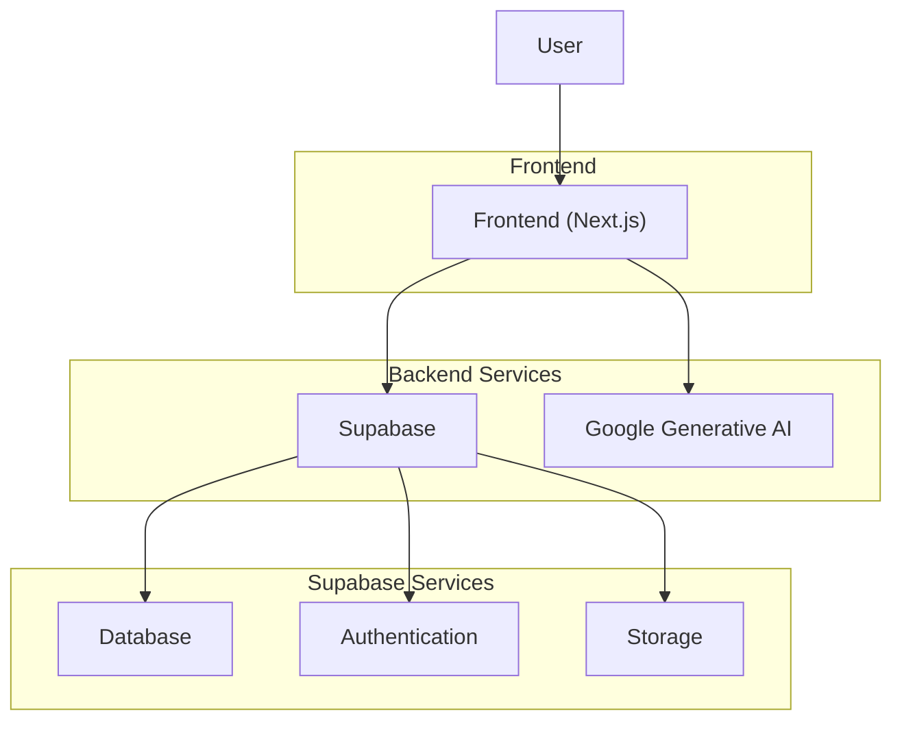
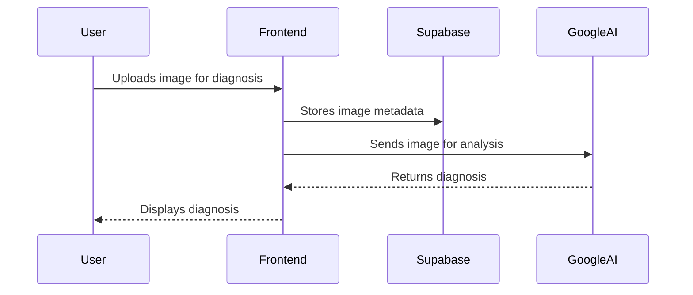
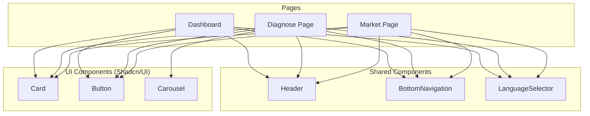

# Architecture

This document outlines the technical architecture of the KrishiMitra application.

## System Architecture

The application is built using a modern, decoupled architecture. The frontend is a Next.js application, which communicates with a Supabase backend for data storage, authentication, and other services. The AI-powered features are integrated using the Google Generative AI API.

## Data Flow

The data flow is designed to be secure and efficient. User data is handled by Supabase, while AI-related data is processed by Google's services.

## Component Interactions

The frontend is built with a component-based architecture, using React and Shadcn/UI components.

## Frontend

-   **Framework:** Next.js (React)
-   **Styling:** Tailwind CSS with Shadcn/UI
-   **State Management:** React Context API
-   **Forms:** React Hook Form with Zod for validation

## Backend

-   **Database:** Supabase (PostgreSQL)
-   **Authentication:** Supabase Auth
-   **Storage:** Supabase Storage
-   **AI:** Google Generative AI

## AI Integration

The application integrates with Google Generative AI for features like crop disease diagnosis. The communication is handled via API calls from the frontend.